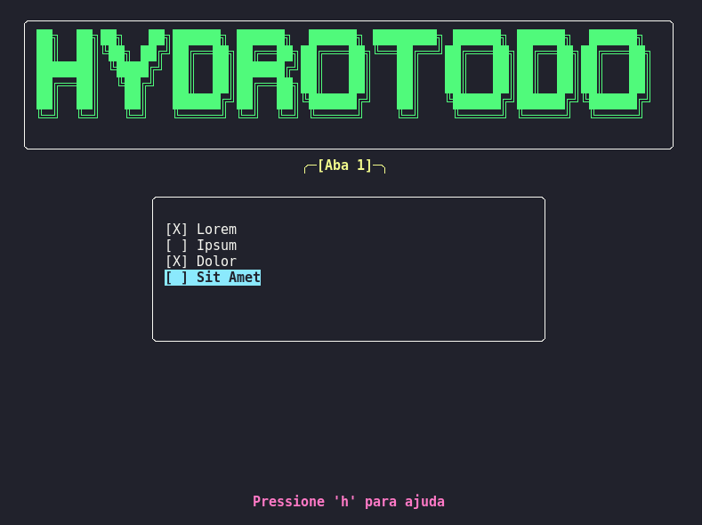

<p align="center">
  
</p>

HydroToDo é um gerenciador de tarefas para terminal, escrito em Python, que permite organizar, marcar e visualizar suas tarefas de forma prática e estilizada, utilizando uma interface TUI (Text User Interface) com `curses`.

---

## Funcionalidades

*   Adição, remoção e marcação de tarefas como concluídas.
*   Interface com abas para múltiplas listas de tarefas.
*   Caixa de tarefas desenhada em ASCII com bordas arredondadas.
*   Ajuda interativa acessível pelo próprio programa.
*   Suporte a atalhos de teclado para navegação rápida.
*   Atualização dinâmica da lista de tarefas.
*   Suporte a redimensionamento mínimo do terminal.

---

## Preview



---

## Requisitos

*   Python 3.6 ou superior
*   Biblioteca padrão `sqlite3` (já inclusa no Python)
*   Terminal compatível com `curses` (Linux, macOS, WSL)

> **Atenção:** Suporte oficial apenas para Linux, macOS e WSL. Usuários Windows podem tentar rodar instalando o pacote `windows-curses`, mas não há garantia de funcionamento ou suporte.

---

## Instalação

Clone o repositório e acesse a pasta do projeto:

```bash
 git clone https://github.com/Henriquehnnm/HydroClock-Project.git
 cd HydroClock-Project/HydroToDo
```

---

## Uso

Execute o script diretamente pelo terminal:

```bash
python3 hydrotodo.py
```

### Atalhos principais

- `↑`/`↓` : Navegar entre tarefas
- `Enter` : Marcar/desmarcar tarefa
- `a`     : Adicionar nova tarefa
- `d`     : Deletar tarefa selecionada
- `Ctrl+T`: Nova aba
- `Ctrl+W`: Fechar aba
- `←`/`→` : Trocar aba
- `h`     : Mostrar/ocultar ajuda
- `q`     : Sair do programa

---

## Estrutura do Código

*   Uso da biblioteca `curses` para criar a interface interativa.
*   Funções para desenhar caixas arredondadas em ASCII.
*   Persistência das tarefas em banco de dados SQLite local.
*   Suporte a múltiplas abas e atalhos de teclado.
*   Tratamento para evitar erros ao desenhar em terminais pequenos.

---

## Considerações

HydroToDo está em desenvolvimento contínuo e ainda está em **Beta**. Sugestões e contribuições são bem-vindas via issues ou pull requests no repositório.

---

## Contato

Para dúvidas ou sugestões, abra uma issue ou entre em contato via email.

<p align="center">
  
</p>
